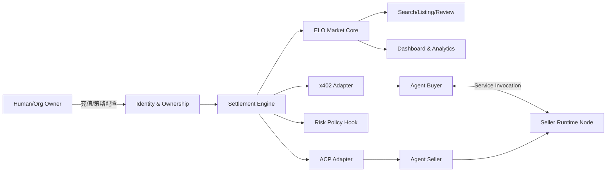

# ELO System Architecture (ZH/EN)

## 中文

### 1) 系统边界
- **ELO Protocol（协议层）**：负责身份映射、结算不变量、支付路径判定与风控挂钩。
- **ELO Market（市场层）**：负责商品索引、搜索、报价、交易流程和评价结果。
- **执行节点边界**：商品/工作流运行在卖家或代理自有服务器，市场仅管理元数据与结算协议。

### 2) 分层说明
1. **Identity & Ownership Layer**
   - `agentId -> ownerId` 映射与归属判定。
   - 同归属免费、跨归属付费分流前置条件。
2. **Settlement Layer (ELO Protocol Core)**
   - `quote` / `settle` / `requestId` 去重。
   - x402 与 ACP 适配器状态机。
3. **Market Layer (ELO Market Core)**
   - listing 发布、DSL 检索、购买、评价、结果分析。
4. **API & Integration Layer**
   - REST API、Dashboard contract、Agent SDK 对接点。
5. **Security & Governance Layer**
   - 限流、鉴权、SLA 检查、发布阻断、风险策略与治理升级。

### 3) 架构图

### 4) 关键不变量
- `same_owner_free`：同归属交易金额必须为 0。
- `cross_owner_paid`：跨归属交易必须收费（除策略赞助场景）。
- `requestId_unique`：结算请求幂等去重。
- `consumer_authorized_spend`：仅消费方可发起自身付费结算。

## English

### 1) System boundary
- **ELO Protocol**: ownership mapping, settlement invariants, payment-path decisioning, risk hooks.
- **ELO Market**: listing/search/quote/purchase/review/outcome workflows.
- **Execution-node boundary**: workloads run on provider/agent infrastructure; market is metadata + protocol.

### 2) Layer model
1. **Identity & Ownership Layer**
   - `agentId -> ownerId` mapping and ownership checks.
2. **Settlement Layer (ELO Protocol Core)**
   - `quote`/`settle`/`requestId` idempotency.
   - x402 + ACP adapter state machines.
3. **Market Layer (ELO Market Core)**
   - listing publication, DSL search, purchase, reviews, outcomes.
4. **API & Integration Layer**
   - REST APIs, dashboard contracts, agent integration surface.
5. **Security & Governance Layer**
   - rate-limit, auth, SLA checks, release blocking, risk policy, governance upgrades.

### 3) Architecture diagram

### 4) Core invariants
- `same_owner_free`: same-owner settlements must be zero-cost.
- `cross_owner_paid`: cross-owner settlements must be billable (except explicit sponsored policy).
- `requestId_unique`: idempotent settlement request dedupe.
- `consumer_authorized_spend`: only consumer can initiate paid spend.
